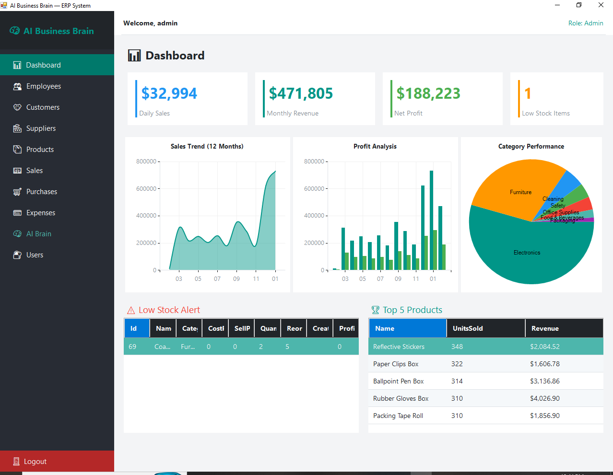
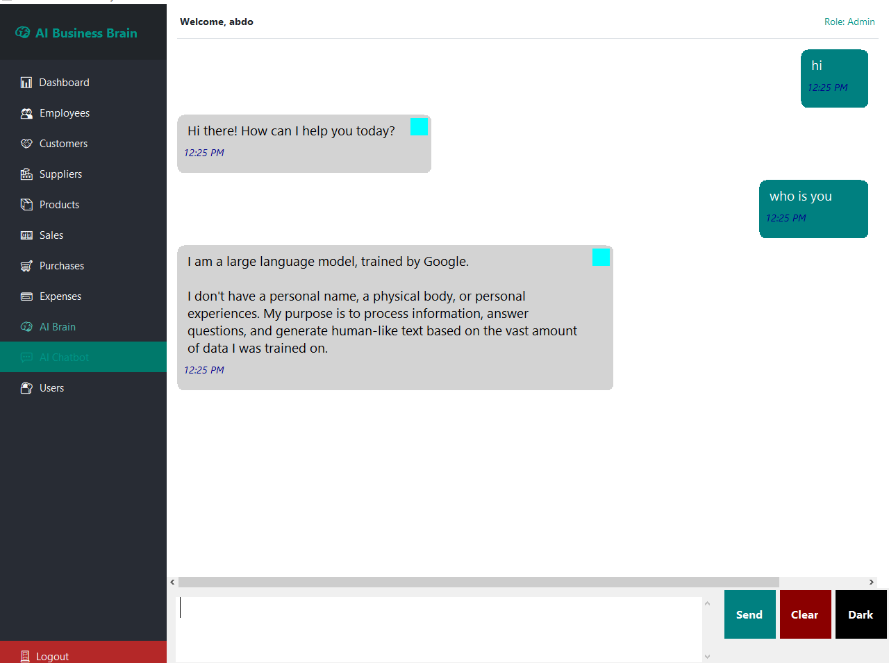
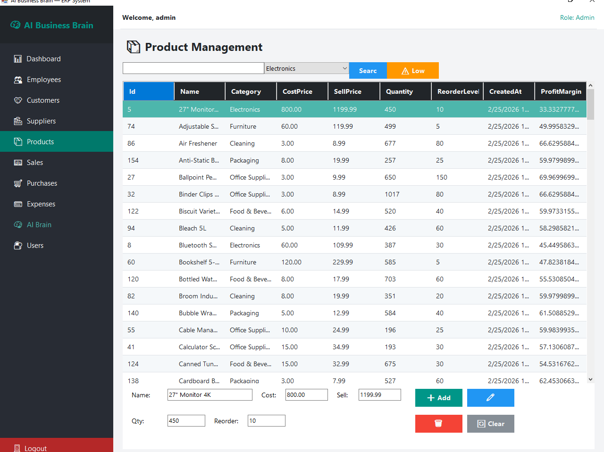
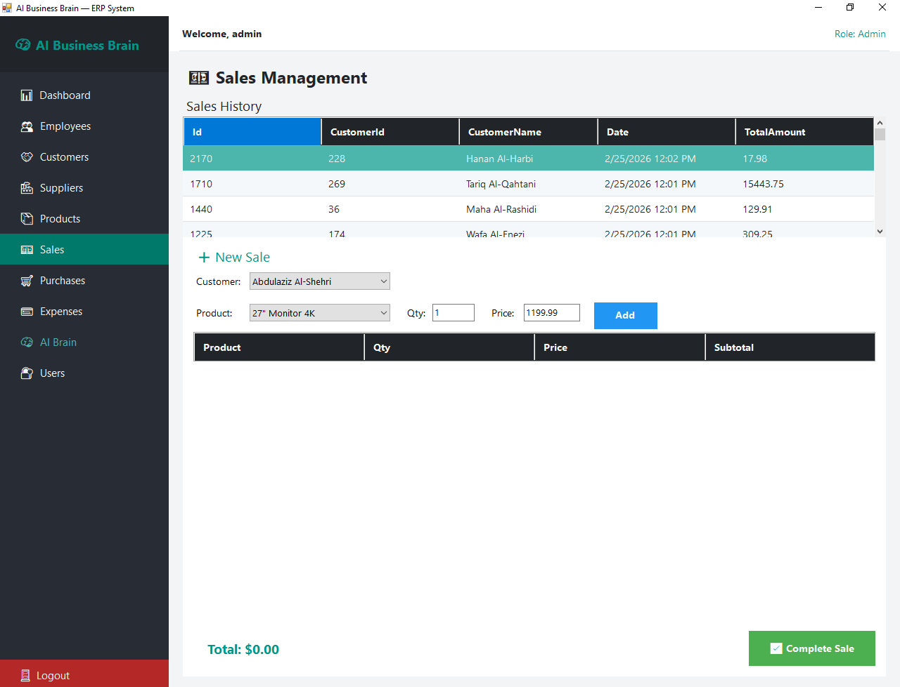
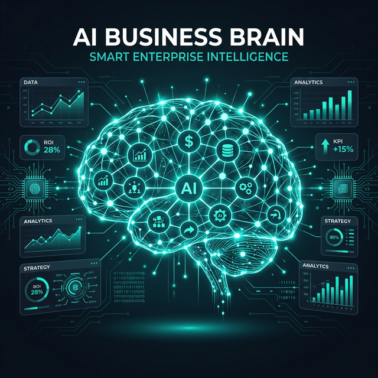

# 🚀 AI-Powered Smart ERP System

A modern, intelligent Enterprise Resource Planning (ERP) system built with **.NET** and integrated with **Cutting-edge AI** capabilities to provide predictive insights and automated business reasoning.

---

## 📸 Project Showcase

### 📊 Main Dashboard

*High-performance dashboard with real-time business KPIs.*

### 🧠 AI & Intelligent Insights
| AI Analysis Engine | Intelligent Business Chat |
| :---: | :---: |
|  |  |
| *Predictive Trends & ML Analysis* | *Gemini-powered Business Advisor* |

---

## 🌟 Key Highlights

This is not just a standard ERP; it is a **Decision Support System** that leverages:
- 🧠 **Generative AI (Google Gemini)**: Natural language business advisor.
- 🔮 **Machine Learning (ML.NET)**: Automated sales forecasting and stock-out predictions.
- ⚡ **High Performance**: Optimized with asynchronous and parallel processing.

---

## 🛠 Features

### 1. 🤖 AI & Machine Learning Suite
- **Predictive Sales Forecasting**: Uses **ML.NET** to analyze historical sales data and predict future trends.
- **Dynamic Business Advisor**: Integrated with **Google Gemini AI** to answer complex business questions.
- **Smart Stock-Out Alerts**: Automatically predicts when products will run out of stock.

### 2. 💼 Core Business Modules
- **Inventory & Products**: Track stock levels and profit margins.

- **Sales & Purchases**: Manage invoices and supplier relationships.

- **Financial Analytics**: Comprehensive financial reporting and net profit tracking.

### 3. 🌍 Localization & UX
- **Full Arabic (RTL) Support**: Tailored UI for Middle Eastern business environments.
- **Onboarding Experience**: Guidance for new users to get started quickly.

---

## 🏗 Technical Architecture

- **Platform**: .NET WinForms (C#)
- **AI/ML**: ML.NET (Time Series), Google Gemini API
- **Architecture**: N-Tier Architecture (BLL, DAL, UI).
- **Optimization**: Implemented `Task.WhenAll` for parallel data fetching.
- **Database**: SQL Server.

---

## 🚀 How to Run

1. Clone the repository.
2. Open the solution in **Visual Studio 2022**.
3. Update the `GeminiApiKey` in [App.config](cci:7://file:///g:/zip%20%20visual%20studio%20project/BussinessErp/BussinessErp/App.config:0:0-0:0) with your Key.
4. Run the `DatabaseSetup.sql` script in your SQL Server.
5. Build and Run!

---

## 👤 Abdalrahman Abotaleb
**Abdalrahman Abotaleb**
- [Your Professional Email]

---
